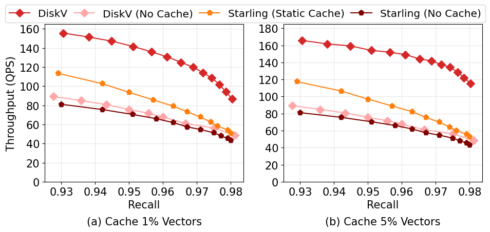

# DiskV

Vector databases have recently drawn significant attention due to the rapid rise of large language models (LLMs). To improve the cost-efficiency of vector search, several disk-based vector indexes—such as SPANN and DiskANN—have been proposed. However, these indexes are mainly optimized for fast SSDs and often perform poorly on low-cost storage devices such as HDDs or cloud-based storage, which are widely adopted in practice to reduce infrastructure costs.

In this work, we introduce **DiskV**, the first disk-based vector index designed to deliver high search performance across heterogeneous storage media, including both **low-cost devices** (e.g., HDDs and cloud storage) and **high-speed devices** (e.g., local SSDs). The core design of DiskV builds upon a **quantization-based indexing structure** (similar to SPANN), which partitions the dataset into large buckets and leverages **sequential access patterns** to better utilize low-cost storage.

To further achieve high performance on fast devices, DiskV introduces several novel optimizations, including **query-aware adaptive search**, **segment-based pruning**, and an **optimized asynchronous I/O engine**. Extensive experiments on three billion-scale datasets demonstrate that DiskV significantly outperforms existing disk-based indexes on low-cost storage (by up to **17×**) while maintaining comparable or superior performance on fast storage (by up to **2.5×**).

We believe DiskV provides a **practical and cost-efficient foundation** for large-scale AI applications that require scalable and high-performance vector search.

---


## Installation

### Dependencies

```
Basic requirements:

- A C++17 compiler (with OpenMP version 2.0 or higher)
- A BLAS implementation (Intel MKL is strongly recommended for best performance on Intel machines)
```

### Compilation

You can quickly build DiskV with the following commands:

```
cd DiskV

cmake -DFAISS_OPT_LEVEL=generic -DBUILD_SHARED_LIBS=ON \
      -DFAISS_ENABLE_GPU=OFF -DFAISS_ENABLE_PYTHON=OFF \
      -DBUILD_TESTING=OFF -DFAISS_ENABLE_C_API=ON \
      -DCMAKE_BUILD_TYPE=Release -B build

make -C build install
```

### Basic Testing

```
make -C build demo_ivfpq_indexing
./build/demos/demo_ivfpq_indexing
```

------

## Experiments

### Usage

DiskV provides two demo scripts: `demo_script.cpp` and `demo_script_hybrid.cpp`.
 The hybrid version supports **searching data stored on two different disks**.

#### Case 1: Search on a single storage device

First, compile the demo script:

```
make -C build demo_script
```

Then run the build and search phases with a parameter script:

```
# Build index
./build/demos/demo_script 0 ./demos/dataset_sift100m.sh

# Search
./build/demos/demo_script 1 ./demos/dataset_sift100m.sh
```

------

#### Case 2: Search across two storage devices

First, compile the hybrid version:

```
make -C build demo_script_hybrid
```

Then run the build and search phases:

```
# Build index
./build/demos/demo_script_hybrid 0 ./demos/dataset_sift1b_hybrid.sh

# Search
./build/demos/demo_script_hybrid 1 ./demos/dataset_sift1b_hybrid.sh
```

------

### Parameters

Recommended parameters for the **SIFT1B**, **DEEP1B**, and **Text2Image1B** datasets are listed below:

| Parameter | Description | Default Value |
|-----------|-------------|---------------|
| `partition` | Number of segments | `10` |
| `nlist` | Number of buckets in each segment | `200,000` (for all datasets) |
| `ratio` | Sampling ratio used during IVF_PQ clustering | `10` (i.e., sample 10%) |
| `m` | Number of sub-vectors in IVF_PQ | `16` (SIFT1B); `24` (DEEP1B); `100` (Text2Image1B) |
| `c_pq` | Number of clusters per sub-vector space | `256` |
| `M` | Maximum neighbor count for the centroid graph | `16` |
| `efb` | Priority queue length during centroid-graph construction | `75` |
| `efs` | Priority queue length during centroid-graph search | `150` |
| `N` | Number of lists to probe during search | `200` |
| `f` | Number of lists to search with sequential I/O | Auto-adjusted (typically `3` for SSD/GP3, `30` for HDD) |
| `ε` (epsilon) | Estimated filtering factor | `0.03` |


------

### Experiments

#### Datasets

We evaluate DiskV on three billion-scale datasets:

| Dataset | Type | Distance | #Dim. | #Vectors | #Queries |
|---------|------|----------|-------|----------|----------|
| SIFT1B | uint8 | L2 | 128 | 1,000,000,000 | 10,000 |
| DEEP1B | float | L2 | 96 | 1,000,000,000 | 10,000 |
| Text2Image1B  | float | IP | 200 | 1,000,000,000 | 100,000 |

#### Storage Performance Statistics

We evaluate DiskV on various storage devices.
`Fio` is used to test the actual IOPS and throughput for both the local disk storage and cloud disk volumes. 
We set the test in a vector search scenario by employing an iodepth of 64 with 16 concurrent jobs. The program runs with 4KB and 128KB block-size respectively to measure the random and sequential I/O performance during a realistic 60-second workload on a 1GB data file. 
Below are the details:
| Disk Storage | Preset IOPS | Tested IOPS | Preset Bandwidth (MB/s) | Tested Bandwidth (MB/s) |
|--------------|-------------|-------------|-------------------------|-------------------------|
| GP3_1 (Cloud SSD) | 3,000 | 3,121 | 125 | 125 |
| GP3_2 (Cloud SSD) | 7,000 | 7,089 | 125 | 125 |
| GP3_3 (Cloud SSD) | 11,000 | 11,173 | 125 | 125 |
| GP3_4 (Cloud SSD) | 16,000 | 16,261 | 125 | 125 |
| IO2 (Cloud SSD) | 18,750 | 18,912 | N/A | 576 |
| Cloud HDD | N/A | 203 | N/A | 27 |
| Local SSD | N/A | 76,352 | N/A | 548 |
| Local HDD | N/A | 339 | N/A | 68 |

#### Results

Each dataset has been divided into 10 segments. The build time is defined as the end-to-end duration from the start of the raw dataset to the completion of building all indexes required for searching. We record the on-disk footprint of each resulting index as index size. 

The query sets for each segment are the same as the query sets from the whole dataset. Query is executed against all segments, and throughput is reported as end-to-end QPS (queries per second).

##### Build time and index size :


##### AWS GP3 Cloud SSD for SIFT1B :


##### AWS GP3 Cloud SSD for DEEP1B :


##### AWS IO2 Cloud SSD :


##### AWS Cloud HDD :


##### Local SSD :


##### Local HDD :


##### Cache Performance on Local SSD for SIFT1B:



